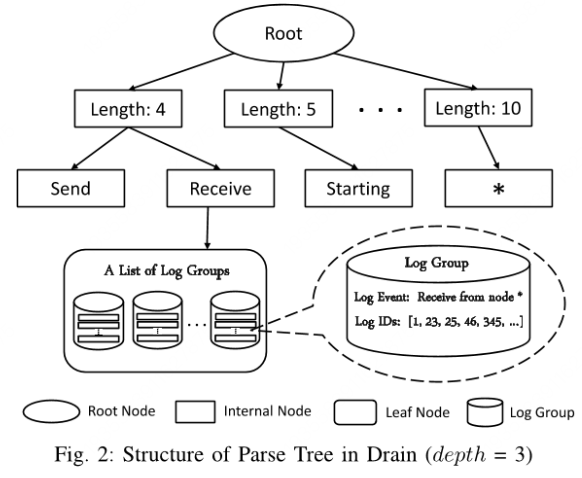
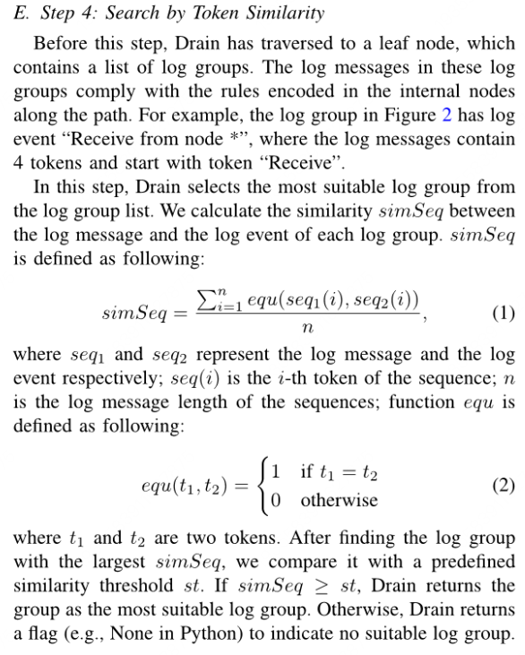
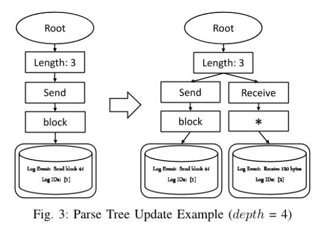

# Drain

Drain(**d**epth t**r**ee b**a**sed onl**i**ne log parsi**n**g method)：基于固定深度树的在线日志解析方法

[paper](../../reference_paper/Drain.pdf)

## 数据结构

### 固定深度前缀树

- 根节点（`depth = 1`）
- **内部节点:**
  - 第二层（`depth = 2`）： 节点值记录[预处理](#1-预处理preprocess)后的Token长度
  - 其他层：节点值记录某个Token内容（类似于前缀树）
- **叶子节点：**
  - 节点值记录一组[日志组](#logcluster)
  - **所有叶子节点深度相同**

  

### Node

- `maxChild`：防止某层Token为数字引起的分支爆炸
- `depth`：当前深度
- `childD`：子节点数组

### LogCluster

对应日志组（Log Group），包含两个部分：

- `Log event` : 日志模板，从原始日志消息中提取出来的常量部分。（可以视作对具有相似的日志进行聚类，得到的Log Group摘要）
- `Log IDs` ： 日志ID组，记录该Log Group内包含的原始日志ID

## 算法步骤

### 1. 预处理（preprocess）

当原始日志消息到达时，我们对其进行预处理。具体来说，Drain允许用户基于领域知识提供简单的正则表达式来表示常用变量，例如IP地址和块ID。然后Drain将通过这些正则表达式从原始日志消息中删除匹配的令牌。例如，图1中的块ID将被“blk[0-9]+”移除。

### 2. 按日志消息长度搜索（treeSearch）

仅限于第一层节点，因为其值为日志消息长度

### 3. 通过Token搜索（treeSeaerch）

假设现在我们已经遍历通过了第一层「日志消息长度」节点，接着我们来到第二层「Token」节点

对日志消息的第一个Token分类讨论：
- 如果日志消息的第一个Token不含有数字，则将其视作「常量Token」，将其与第二层的节点匹配。
- 如果日志消息的第一个Token含有数字，则将其视作「特殊Token」。第二层设有「特殊Token节点」（值为`"*"`）匹配这个特殊Token。
- 我们还定义了一个参数maxChild，限制了节点的最大子节点数。如果一个节点已经具有`maxChild`个子节点，则任何未匹配的令牌都将匹配所有其子节点中的特殊内部节点`“*”`。

重复步骤3直到遍历到叶子节点

### 4. 通过Token相似度搜索

到达这一步，说明我们已经遍历到叶子节点了，接下来考虑的是选择哪一个Log Group

论文提供了[计算每个Log Group中log message和log event相似度的方法](../../reference_paper/Drain.pdf)，对应代码的`seqDist`

  

!!! tip

    这里说的log message是我们一直在匹配的原日志消息

### 5. 更新解析树

如果在步骤4中返回了合适的日志组，Drain将添加当前日志消息的日志ID到返回的日志组中的日志ID。此外，返回的日志组中的日志事件也会更新。具体来说，Drain扫描日志消息和日志事件在同一位置的令牌。如果两个令牌相同，则我们不修改该令牌的位置。否则，我们将通过在日志事件中使用通配符（即*）来更新该令牌的位置。

如果Drain无法找到合适的日志组，它将根据当前的日志消息创建一个新的日志组，在该日志组中，日志ID仅包含日志消息的ID，并且日志事件是确切的日志消息。然后，Drain会使用新的日志组更新解析树。直观地讲，Drain从根节点开始遍历到应该包含新日志组的叶节点，并相应地沿路径添加缺失的内部节点和叶节点。例如，假设当前解析树如图3左侧所示，则收到一条新的日志消息“Receive 120 bytes”。然后Drain会更新解析树以右侧的树如图3所示。请注意，第三层中的新内部节点编码为“*”，因为数字“120”包含在令牌中。

  
